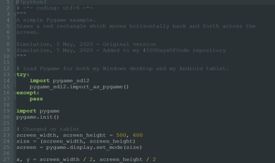

Title: Day 2: Images in GitHub Jekyll Blog Posts
Date: 2020-05-08
Modified: 2020-05-10
Category: Posts

I spent my time today learning about GitHub Pages, and trying to get an image to display in my blog post. Yesterday I configured the default [Jekyll](https://help.github.com/en/github/working-with-github-pages/setting-up-a-github-pages-site-with-jekyll) site generator tool with the [Minima](https://github.com/jekyll/minima) theme. I placed my initial website contents in the `docs` folder in the master branch of my repository. I create a subfolder `doc/images` on my local drive, and added a simple screenshot `image1.png`. After committing this change, and syncing with GitHub, I confirmed that the folder and file were present in my repository. So far, so good.

*10 May 2020: Since writing this post, I have moved from Jekyll to a Python based site generator tool called Pelican, so the links below may display differently than they did before.*

## Broken Images ##

I was able to display an image easily enough from a standard page in the root of my website with a Markdown image link:

```

```

But the same link format wasn't displaying properly in my blog post:


OK, so blog post files are in a different folder `_posts`.  Maybe I need to use a rooted path:

```

```

which displayed


Hmm, this didn't work either - it seems that the `/images` directory that GitHub sees is not the same as the one I created. Neither did assuming the website root was one level up, at the root of the entire repository:

```

```

I get the same broken image link:


## Solved! ##

After some investigation, I paid attention to the blog post URL in my brower's address bar, and realised my post is buried three levels down in a virtual folder hierarchy, with the year, month and date all represented by folders:

https://simulatine.github.io/100DaysOfCode/2020/05/08/Struggling-With-GitHub-Pages.html

Aha! Maybe a relative path would work. I would need to go three levels up from my post's URL to get back to the root of the website, so would need `../` three times:

```

```

Success! I can finally see an image:


